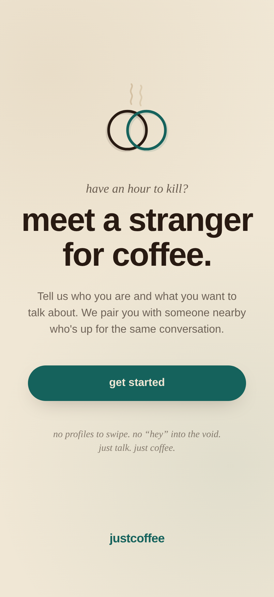
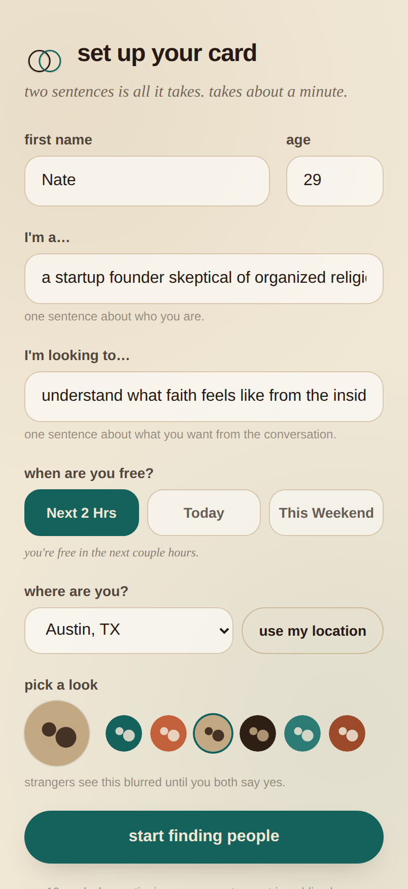
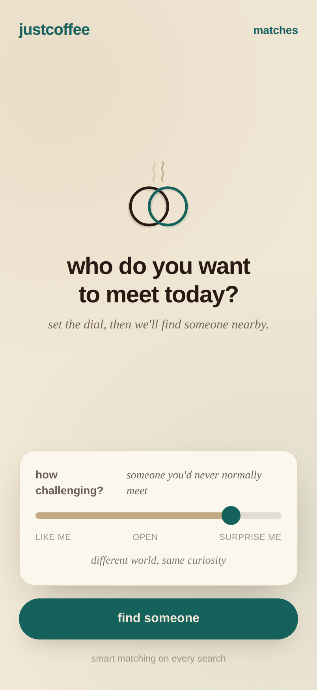
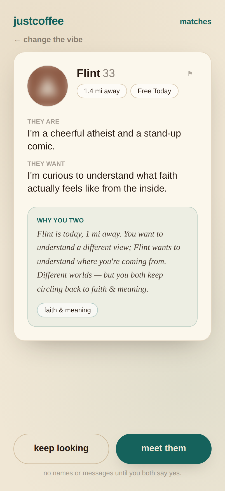
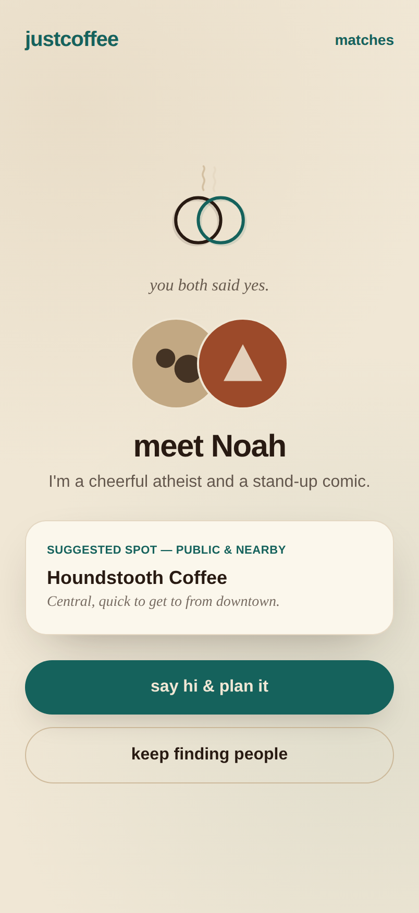
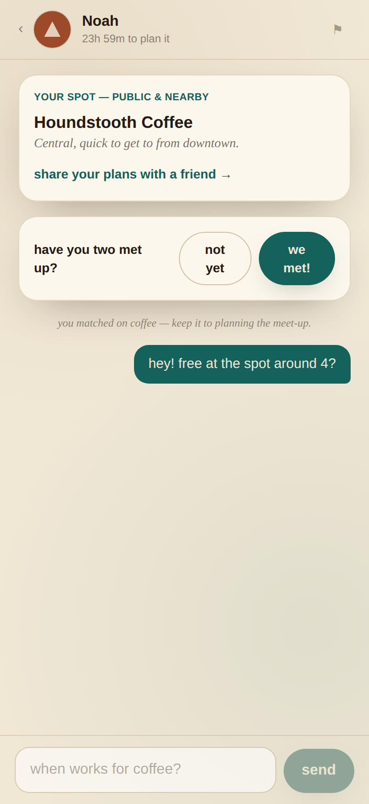

# justcoffee

**have an hour to kill? meet someone for coffee.**

justcoffee pairs you with someone nearby who wants to talk about the same thing
you do — defined broadly, and matched by AI. You write one sentence about who you
are and one about what you want from a conversation, set a dial for how
*challenging* you want it to be, and get introduced to one person at a time. You
don't learn their name, see their photo, or message them until you **both** say
yes to coffee.

It borrows the best mechanics of a dating app — quick profiles, location-based
pairing, mutual opt-in reveal — and strips out the parts that make them
high-stakes. It's a utility for getting offline and into a real conversation.

> no profiles to swipe. no "hey" into the void. just talk. just coffee.

This repo is a working MVP of that product.

---

## Screens

| | | |
|---|---|---|
|  |  |  |
| **Landing** | **Onboarding** — two sentences | **Find** — the challenge dial |
|  |  |  |
| **Match card** — blurred, why-you-two | **Reveal** — both said yes | **Chat** — plan it + safety |

---

## The core loop

0. **Sign in** — a passwordless **magic link**. Enter your email and tap the link
   to start a session (with no email provider configured, the link is surfaced
   on screen so the flow works locally).
1. **Onboarding** — first name, age, an avatar **or a real photo (with an
   optional verification badge)**, two sentences ("I'm a…" / "I'm looking to…"),
   and where you are (city or device GPS). Your card is **editable any time**.
2. **Before each search** — pick **when you're free** (right now / today / this
   weekend). If you're free right now, say **how long you have** (30 min / 1 hr /
   2 hrs). Set the **challenge dial**: how far outside your bubble to go,
   from *"someone like me"* to *"someone I'd never normally meet."*
3. **Find someone** — the matcher returns one nearby person: a **blurred** avatar,
   a pseudonym, their two sentences, and a "why you two" note.
4. **Meet them / keep looking** — one person at a time. No stack, no gamification.
5. **Mutual reveal** — when both say yes, names and photos unlock, plus a suggested
   **public** coffee spot that's genuinely walkable from the midpoint (it falls
   back to a neighborhood cafe at the midpoint rather than sending you across town).
6. **Plan it** — messaging unlocks *only* after a mutual match, and is nudged toward
   logistics. Chat is **realtime** (Server-Sent Events, no polling) and a new match
   or message raises a live notification anywhere in the app. Matches expire after
   24h if you don't coordinate.
7. **Did you meet?** — a lightweight post-coffee prompt that closes the loop.

**Safety throughout:** block & report are available *before* the reveal, the app
only ever suggests public places, you can one-tap "share your plans" with a
trusted contact, and it's 18+.

---

## The matching engine (the core IP)

`lib/matching.ts` scores every eligible person on five signals and ranks them:

- **Distance** (haversine; capped to the same metro)
- **Availability overlap** (right now / today / this weekend; duration when right now)
- **Topic overlap** of the two sentences (a small topic lexicon — politics, faith,
  parenting, building things, the planet, …)
- **The challenge dial** — this is the key feature. Low challenge rewards *similar*
  backgrounds; high challenge rewards *different* backgrounds **that still share a
  topic**, so a "surprise me" match is never random.
- **Intent compatibility** — what each person wants *out of* the conversation
  (debate / learn / teach / vent / listen / advice / befriend). Complementary
  intents score highest (one wants to share, one wants to learn), and two passive
  "venters" score lowest. This is the always-on safety valve: even very different
  people are only matched when their conversational intent fits.

It also writes the human-readable **"why you two"** note from those signals.

### Optional: Claude-written rationale

The ranking is always deterministic, so the app works with **zero external
dependencies**. If `ANTHROPIC_API_KEY` is set, `lib/claude.ts` uses Claude
(`claude-opus-4-8`) to rewrite the "why you two" note in justcoffee's voice. With
no key, the built-in rationale is used and the product is identical.

---

## Tech stack

| Layer | Choice |
|---|---|
| Framework | Next.js 15 (App Router) + React 19 + TypeScript |
| Styling | Tailwind CSS, with the campaign's palette + Helvetica Neue / Georgia |
| Data | A file-backed JSON store (`lib/db.ts`) behind a small repository API |
| Auth | Passwordless **magic link** (`lib/magic.ts`) → signed-cookie session |
| Realtime | In-process pub/sub (`lib/events.ts`) streamed over SSE (`/api/stream`) |
| Photos | Local upload (`lib/uploads.ts`), served auth-gated; blurred until reveal |
| Matching | Deterministic engine in `lib/matching.ts` (+ optional Claude) |

The store is deliberately swappable: every call site uses the helpers in
`lib/db.ts`, not the storage mechanism, so moving to Postgres/Supabase later is a
single-module change. The MVP is a responsive, mobile-first web app so the whole
product is viewable in a browser today; the data model, API, and matching logic
all carry over to the eventual React Native build.

---

## Running it

```bash
npm install
npm run dev          # http://localhost:3000
# or a production build:
npm run build && npm run start
```

On first boot the store seeds ~16 demo people (Austin-dense, mirroring the
go-to-market plan) so the matching loop is real with a single live user. Demo
people respond to a "meet them" with a stable yes/no, so mutual matches *and*
"keep looking" both happen. To experience a real two-sided match, open a second
browser, sign in with a different email, onboard as a second person in the same
city, and have each say yes — the reveal, the live notification, and realtime
chat all fire across the two sessions.

### Environment

Copy `.env.example` to `.env.local`. Everything is optional:

- `ANTHROPIC_API_KEY` — enables the Claude-written match rationale.
- `JUSTCOFFEE_SESSION_SECRET` — set any random string in production.

### Handy

- `POST /api/reset` — reseed the demo world and sign out.
- `npm run seed:reset` — delete the local store file.

---

## Project layout

```
app/
  page.tsx                 landing (routes by session + profile state)
  signin/                  passwordless magic-link sign in
  onboarding/              create or edit your card (two sentences, photo, location)
  find/                    availability + challenge dial + search + match card + reveal
  matches/                 list + per-match realtime chat / spot / safety / post-coffee
  template.tsx             app-wide screen transition
  api/                     session, auth (request/verify), profile, photo, verify,
                           search, meet, pass, matches, messages, met, share,
                           safety, reset, stream (SSE)
lib/
  matching.ts              the ranking engine + "why you two"
  text.ts                  topic + intent detection, similarity
  claude.ts                optional Claude rationale
  db.ts / seed.ts          file-backed store + demo people
  events.ts                in-process pub/sub for live updates (swap → Redis)
  magic.ts                 magic-link tokens (swap → email provider)
  uploads.ts               photo storage helpers (swap → S3/R2)
  cities.ts                launch cities + dense public coffee spots
  geo.ts / types.ts / session.ts / auth.ts / actions.ts
components/
  Logo.tsx                 the overlapping-rings + steam mark
  ChallengeSlider.tsx      the similar↔different dial
  LiveNotifier.tsx         app-wide SSE notifications + toasts
  useEventStream.ts        client hook for the live stream
  MatchCard.tsx  Avatar.tsx  VerifiedBadge.tsx
```

---

## What's built vs. what's still ahead

Most of the original "for later" list now ships in this MVP, each behind a clean
seam so the production swap is a single module:

- **Passwordless auth** — magic-link sign in (`lib/magic.ts`). Wire an email
  provider (Resend/Postmark/SES) in `app/api/auth/request`; OAuth can sit beside it.
- **Photo upload + verification** — local upload + an auth-gated serving route,
  blurred until the mutual reveal, with a lightweight verification badge. Point
  `lib/uploads.ts` at object storage and swap the `/api/verify` stub for a real
  identity/liveness provider (Stripe Identity, Persona).
- **Realtime messaging** — chat and notifications run over Server-Sent Events
  (`/api/stream`) off an in-process bus (`lib/events.ts`); no more polling. For
  multiple instances, swap the bus for Redis pub/sub or Postgres LISTEN/NOTIFY.
- **Live notifications** — new matches/messages raise an in-app toast plus a
  native browser notification (when permitted), anywhere in the app.

Genuinely still ahead:

- **Background push notifications** — the in-app/native notifications above work
  while a tab is open; true background Web Push needs a service worker + VAPID keys.
- **A hosted database** — the store stays file-backed (`lib/db.ts`); every call
  site already goes through its repository helpers, so moving to Postgres/Supabase
  is a one-module change.
- **The native app** — a separate React Native project; the data model, API, and
  matching logic all carry over.
